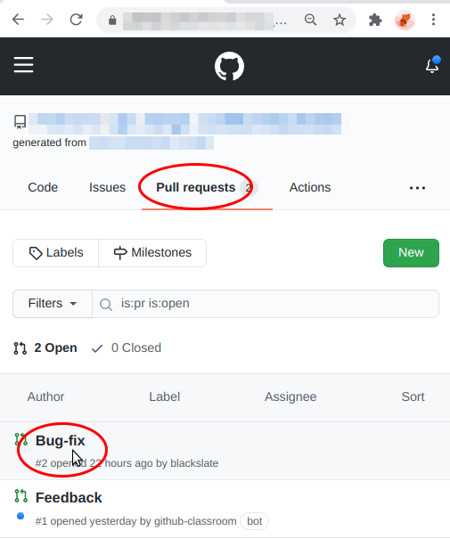
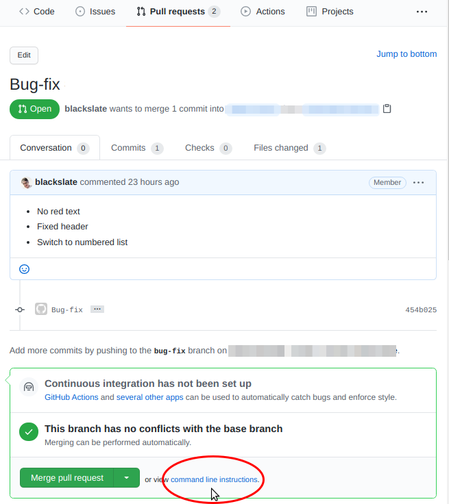
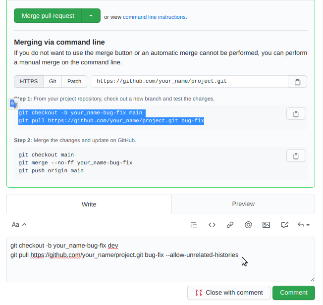
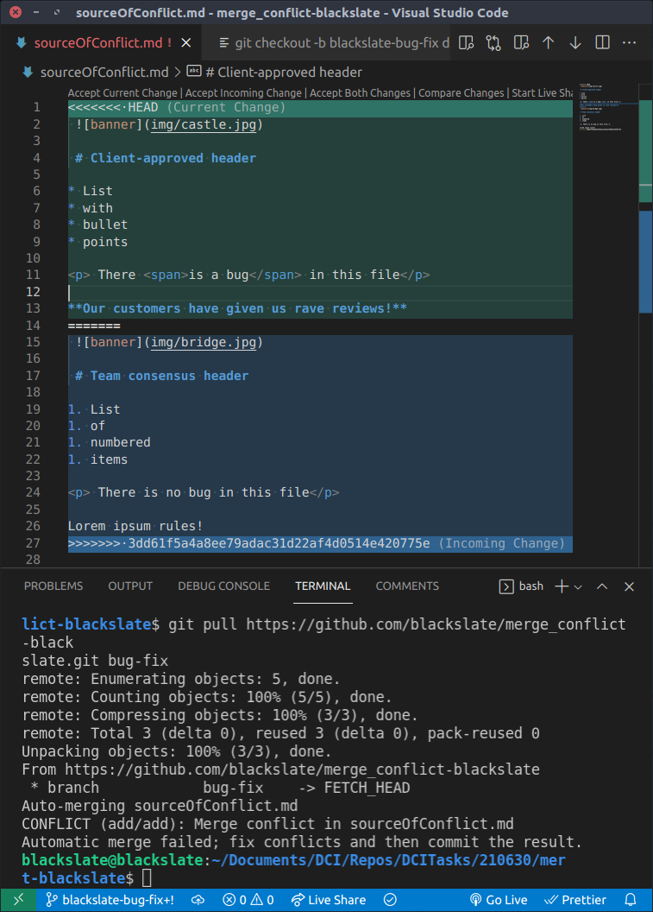

# Handling a Git Merge Conflict

In this exercise, you and a partner will make different changes to the same MarkDown document. This will generate a Merge Conflict, which you must then resolve.

The exercise is in four parts, and there are two roles: owner and team member. You can work through the exercise twice: the first time, one of you will be the owner, the other will be the team member. The second time, you can switch roles.

You can take it in turns to share your screen with your partner, as you work on your specific part.


## Instructions

### Part 1: Working as an owner, making changes to `dev`
1. Choose a partner
2. Give your partner a link to this GitHub repository
3. Clone your repository to your development machine. (Choose carefully which folder you use to hold your local repository.)
4. _You will be the owner of your own repository._

Imagine that you have spoken with the client, and that you are acting with authority. You are now going to make some changes in the `dev` branch, and test them locally.

6. `cd` into your cloned repository
7. Open the repository folder in VS Code
8. Checkout the `dev` branch
9.  Provide a _cosmetic_ fix for the bug by removing the style from the span, so that it no longer appears red. But the bug is still there. It's just hidden. So don't change the text.
10. Make some changes to your local repository. For example:
   * Choose a different banner image
   * Change the header
   * (Leave the list as it is)
   * Add a paragraph of text
11. Run `git status` to see which files have changed
12. Run `git diff` to see which files have been edited
13. Use `git add .` to add your changes to git's staging area
14. Use `git commit` to commit your changes
15. When writing the commit message:
   * Refer to the output of the `git status` and `git diff`
   * Create a short descriptive title
   * Provide details of all the changes that you have made
   * Remember that you know the context of what you are writing, but other readers (including yourself in 3 weeks' time) will not know the context. So make your notes clear and detailed.
---
### Part 2: Working as a team member, making changes in a `bug-fix` branch
1. Fork the repository for which your partner sent you a link.

You will have __read-write access_ to your fork, but only _read access_ to your partner's repository. You need to fork the repository, so that you can push your work to GitHub. GitHub will then suggest that you create a pull request for your partner to review.

2. Clone your fork to your development machine. **Choose carefully which folder you use to hold your local repository. Do NOT put it inside the same folder as the repository for which you are the owner.**
3. Use `git remote -v` to check that an `upstream` remote for your repository exists.
4. If not, use `git remote add upstream <source>` where `source` will be the Code link from the URL that your partner sent you.

> **Example**
>
> Your partner's GitHub repository is at:
>
> https://github.com/owner/project
>
> When you click on the green Code button on the `<Code>` > tab for your partner's repository, you see:
>
> `git@github.com:owner/project.git`
>
> Your fork of this repository is at:
>
> https://github.com/your_name/project
>
> When you click on the green Code button on the `<Code>` tab for your partner's repository, you see:
>
> `git@github.com:your_name/project.git`
>
> When you run the command `git remote -v` in the Terminal, you should see:
> ``` bash
> origin    git@github.com:your_name/project.git (fetch)
> origin    git@github.com:your_name/project.git .git (push)
> upstream  git@github.com/owner/project.git` (fetch)
> upstream  git@github.com/owner/project.git (push)
> ```
> If you do not see an `upstream` remote, you should run the following command...
>
> `git remote add upstream  git@github.com/owner/project.git`
>
> ... then test `git remote -v` again.


  Imagine that you have spoken with the dev team, and that you have to make an important bug fix, and also make some minor changes.

5. Create a new branch with a name that describes the feature that you are planning to work on. You can give this branch any name you like but make sure that it is descriptive of the changes that you plan to make. I'll call it `bug-fix`. Base this on the current `dev` branch:

   `git checkout -b bug-fix dev`

__This command says: "`git`, please `checkout` a new `-b`ranch called `bug-fix` and copy the current contents of the `dev` branch into it, as the starting point"._

6. As the owner did above, make some changes to your local fork. For example:
   * Fix the bug (remove the style, edit the text to "There is no bug in this file")
   * Choose a different banner image
   * Change the header
   * (Leave the list as it is)
   * Add a paragraph of text
7.  Use `git add .` to add your changes to git's staging area
8.  Run `git status` to see which files have changed
9.  Run `git diff` to see which files have been edited
10. Use `git add .` to add your changes to git's staging area
11. Use `git commit` to commit your changes
12. When writing the commit message:
   * Refer to the output of the `git status` and `git diff`
   * Create a short descriptive title
   * Provide details of all the changes that you have made
   * Remember that you know the context of what you are writing, but other readers (including yourself in 3 weeks' time) will not know the context. So make your notes clear and detailed.

> This is currently the state of the project:
> * There are four repositories:
>   1. The owner's local repository on their development machine
>   2. The owner's authoritative repository on GitHub (`upstream`)
>   3. Your fork on GitHub of the authoritative repository (`origin`)
>   4. Your local clone of the forked repository
> * The two repositories on GitHub (2, 3) share identical content
> * The owner's local repository (1) contains changes to the `dev` branch
> * Your local repository (4) contains a `dev` branch which is identical to the GitHub repositories' (2, 3) and a new `bug-fix` branch.
>
> The following steps will allow your `bug-fix` branch to travel first to your GitHub fork (3), then to the owner's GitHub repository (2), so that the owner can pull your changes to the repository on their development machine to test and review it.

13. Push your changes to your fork:
   `git push origin bug-fix`
14. Go to your GitHub fork in your browser and click on the green Compare & Pull Request button that should have appeared.
15. If you don't see this button, ensure the Pull Requests tab is active, and that the `bug-fix` branch is selected.
16. Check that the automatically created message is meaningful, and if not, edit it. Add a personal note, if you want.
17. Click on the green Create Pull Request button.
18. GitHub will probably now take you to the page for the owner's repository.

> In a real project, you might in fact make a number of commits and push them all to your local fork before you make the Pull Request. This is why GitHub does not generate the Pull Request automatically, but waits until you are ready.
---
### Part 3: Working as the owner: reviewing the pull request
When you receive notification of the PR created by your team member:
1. Visit your repository on GitHub
2. Click on the Pull Request tab
3. You will probably see two pull requests. You can ignore the Feedback PR: this is generated automatically by GitHub Classrooms, so that your mentors can provide you feedback on your work.
4. Click on the other pull request. Its name will depend on the title that your team member used for their commit message.



> GitHub helpfully provides a big green Merge Pull Request button but **do NOT click on this**. This button allows you to merge the pull request directly in GitHub, but it does not give you the chance to test that everything is working correctly and that it looks good before you commit.
> This is only useful for treating very minor changes. Indeed, it will be probably be disabled for any changes that result in a conflict.
>
> Instead, click on the link to view `command line instructions` and review the lines of code for Step 1. These are designed to allow you to pull the proposed changes to your development machine, but they are not exactly what you need, so you will need to edit them.
> 
> The automatically generated code creates a new branch based on `main`, but you need to create a branch based on `dev`. The automatically generated code assumes that the pull request was created within the current repository itself, but your pull request was created in a fork through Github Classroom.

1. Copy the two lines of code for Step 1, and paste them in the convenient "Leave A Comment" field below.
2. Change them as follows:
   * Change `main` to `dev` on the first line, like this:
   ```bash
   git checkout -b <your_name-bug-fix> dev
   git pull <link to collaborator git repository>.git bug-fix
   ```
   
3. Ensure that you have the folder for your project open in VS Code
4. Copy the edited lines and paste them into the Terminal pane, then press Enter. This will pull the changes from your team member's feature branch.

> It's possible that `git` might refuse to merge your collaborator's branch, with the error "fatal: refusing to merge unrelated histories". If this is the case, add the argument `--allow-unrelatedshistories` as shown in the screenshot abave. ([More information here](https://www.educative.io/edpresso/the-fatal-refusing-to-merge-unrelated-histories-git-error))



5. In the VS Code editor, you should now see both your version and your collaborator's version, against a coloured background. You will need to:
   * Choose which incoming changes you want to accept
   * Choose which current changes you want to keep
   * Ensure that the three lines...
     ```
     <<<<<<< HEAD (Current Change)

     =======

     >>>>>>> longIdStringMadeOfRandomLettersAndNumbers (Incoming Change)
     ```
     ... are deleted.
6. Remember: you are the owner. You have responsibility to the client. Your decision is final.
7. When you are satisfied, commit the changes. You will see an automatically generated message. Why is it red? Why should you not use this?
8. In the commit message:
   * Create a short descriptive title
   * Provide details of all the changes that you have made
9.  Hold a meeting with your team member, to reach consensus on what should be merged to the `dev` branch.
10. Checkout the `dev` branch
11. Merge the changes from the feature branch.
    `git merge --no-ff <team-members-feature-branch>`
12. Push the updated `dev` branch to your GitHub repository
    `git push origin dev`
13. Ask your team member to pull the changes from the `dev` branch.

---
### Part 4: Working as team member, updating your repositories
When you receive notification from the owner that the `dev` branch has been updated:
1. Checkout the `dev` branch
2. Run `git pull upstream dev`
3. Check that everything looks the way you expected after your discussions with the owner. If not, go through this cycle again.
4. Finally, push the updated version of your `dev` branch to your GitHub repository.

> Now, all 4 repositories should be in the same state:
>   1. The owner's local repository on their development machine
>   2. The owner's authoritative repository on GitHub (`upstream`)
>   3. Your fork on GitHub of the authoritative repository (`origin`)
>   4. Your local clone of the forked repository
> In all the repositories, the `main` branch will be unchanged, and the `dev` branch will have been updated.

5. If all is well, you can now delete your `bug-fix` branch:
   ```
   git branch -d bug-fix
   ```
